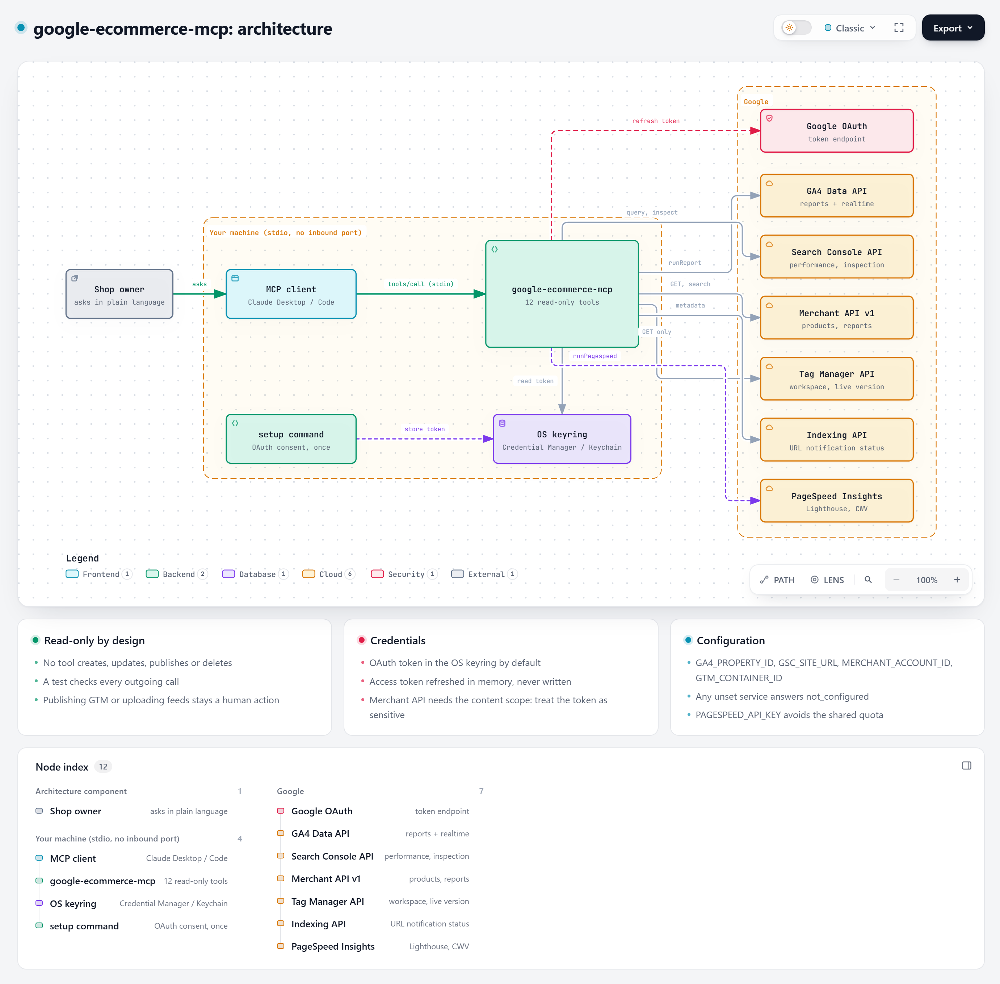
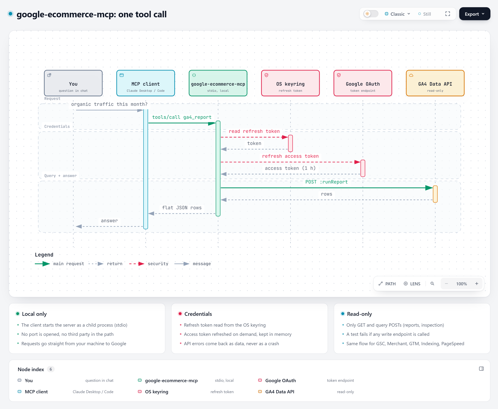

# google-ecommerce-mcp

One read-only MCP server for the Google services an online shop lives on: **GA4, Search Console, Merchant Center, Tag Manager, Indexing API and PageSpeed**.

Ask your AI assistant "how much organic traffic did we get this month?", "which products are disapproved in Merchant Center?" or "is GA4 loaded twice on my site?" and it answers from your own Google accounts.

Built by [MoonEyes](https://www.mooneyeswargame.com), a small French shop selling 3D-printed tabletop terrain, because no existing MCP server covered GA4, Search Console and Merchant Center together.




## Documentation

| Page | What is in it |
|---|---|
| [Architecture](docs/ARCHITECTURE.md) | Components, a tool call step by step, design choices, sequence diagrams |
| [Tool reference](docs/TOOLS.md) | Every tool: parameters, output, example questions |
| [Google Cloud setup](docs/SETUP-GOOGLE-CLOUD.md) | OAuth client, APIs to enable, where to find each id |
| [Security model](docs/SECURITY.md) | Scopes, token storage, threats, how to revoke |
| [Troubleshooting](docs/TROUBLESHOOTING.md) | Every error we have met and its fix |
| [Example prompts](examples/PROMPTS.md) | Questions that work well, by use case |
| [Client configs](examples/) | Claude Desktop (one or two shops), Claude Code |

## Why this one

- **All-in-one for e-commerce.** Other MCP servers cover one or two of these services. This one covers the six a shop owner checks every week.
- **Read-only by design.** No tool creates, updates, publishes or deletes anything. A test enforces it.
- **Token in your OS keyring.** The OAuth token goes to Windows Credential Manager, macOS Keychain or Secret Service, not to a plain file (a file is still possible if you prefer).
- **No third party.** Requests go straight from your machine to Google.

## Tools

| Tool | Service | What it answers |
|---|---|---|
| `server_status` | All | Which services are configured, does the token work |
| `ga4_report` | GA4 | Any report: channels, landing pages, purchases, revenue, by period |
| `ga4_realtime` | GA4 | Last 30 minutes, e.g. to check a page view is counted once |
| `gsc_performance` | Search Console | Clicks, impressions, CTR, position by query, page, country, device, date |
| `gsc_inspect_url` | Search Console | Is this URL indexed, which canonical did Google pick, last crawl |
| `gsc_sitemaps` | Search Console | Declared sitemaps, last download, errors |
| `merchant_data_sources` | Merchant Center | Feeds, labels, countries, fetch URLs |
| `merchant_product_issues` | Merchant Center | Products with disapprovals or warnings, all pages |
| `merchant_report_query` | Merchant Center | Any Merchant Query Language report |
| `gtm_inventory` | Tag Manager | Tags, triggers, variables, live version |
| `indexing_status` | Indexing API | What Google knows about a submitted URL |
| `pagespeed` | PageSpeed Insights | Lighthouse performance and SEO scores, Core Web Vitals |

## Setup

### 1. Google Cloud (once, about 10 minutes)

Full walkthrough with every click explained: [docs/SETUP-GOOGLE-CLOUD.md](docs/SETUP-GOOGLE-CLOUD.md). Short version:

1. In [Google Cloud Console](https://console.cloud.google.com/), create or pick a project.
2. Enable the APIs you need: *Google Analytics Data API*, *Google Search Console API*, *Merchant API*, *Tag Manager API*, *Web Search Indexing API*, *PageSpeed Insights API*.
3. Configure the OAuth consent screen (External, add yourself as a test user).
4. Create an OAuth client of type **Desktop app** and download its JSON file.
5. Merchant API only: [register your Cloud project](https://developers.google.com/merchant/api/guides/quickstart) with your Merchant Center account.
6. Optional: create an API key restricted to PageSpeed Insights (the anonymous quota is shared and often exhausted).

### 2. Install and authorize

```bash
# with uv, straight from GitHub (recommended)
uvx --from git+https://github.com/MoonEyes/google-ecommerce-mcp google-ecommerce-mcp setup --client-secret path/to/client_secret.json

# or with pip
pip install git+https://github.com/MoonEyes/google-ecommerce-mcp
google-ecommerce-mcp setup --client-secret path/to/client_secret.json
```

A PyPI release (`uvx google-ecommerce-mcp`) will follow; until then, install from GitHub as above.

Your browser opens the Google consent screen. The token is then stored in your OS keyring. Check everything with `google-ecommerce-mcp check`.

### 3. Add it to your MCP client

**Claude Desktop** (`claude_desktop_config.json`):

```json
{
  "mcpServers": {
    "google-ecommerce": {
      "command": "uvx",
      "args": ["--from", "git+https://github.com/MoonEyes/google-ecommerce-mcp", "google-ecommerce-mcp"],
      "env": {
        "GA4_PROPERTY_ID": "123456789",
        "GSC_SITE_URL": "sc-domain:example.com",
        "MERCHANT_ACCOUNT_ID": "1234567890",
        "GTM_CONTAINER_ID": "GTM-XXXXXXX",
        "PAGESPEED_API_KEY": ""
      }
    }
  }
}
```

**Claude Code**:

```bash
claude mcp add google-ecommerce -e GA4_PROPERTY_ID=123456789 -e GSC_SITE_URL=sc-domain:example.com \
  -e MERCHANT_ACCOUNT_ID=1234567890 -e GTM_CONTAINER_ID=GTM-XXXXXXX \
  -- uvx --from git+https://github.com/MoonEyes/google-ecommerce-mcp google-ecommerce-mcp
```

Every variable is optional: a tool for a service you did not configure simply answers `not_configured`.

| Variable | Example | Used by |
|---|---|---|
| `GA4_PROPERTY_ID` | `123456789` (numeric property id) | GA4 tools |
| `GSC_SITE_URL` | `sc-domain:example.com` or `https://www.example.com/` | Search Console tools |
| `MERCHANT_ACCOUNT_ID` | `1234567890` | Merchant tools |
| `GTM_CONTAINER_ID` | `GTM-XXXXXXX` | `gtm_inventory` |
| `PAGESPEED_API_KEY` | API key | `pagespeed` |
| `GOOGLE_TOKEN_FILE` | `~/.config/google-ecommerce-mcp/token.json` | store the token in a file instead of the keyring |

## How a call works



## Security notes

Details: [docs/SECURITY.md](docs/SECURITY.md).

- The server never calls a write endpoint (no Tag Manager publish, no feed upload, no sitemap submission). `tests/test_server.py::test_every_call_is_read_only` checks every outgoing call.
- Scopes are read-only except **Merchant Center** (`content`) and **Indexing API** (`indexing`): Google has no read-only scope for these. The server does not use them to write, but treat the token as sensitive, or remove those scopes if you do not need the services.
- Revoke access at any time from your [Google account permissions](https://myaccount.google.com/permissions).

## Limitations

- The Merchant API is recent and Google keeps changing it; the older Content API for Shopping is being shut down. Open an issue if a call breaks.
- One property, site, Merchant account and container per server instance. Run several instances for several shops.
- GA4 Data API quotas apply to `ga4_report`.

## Contributing

See [CONTRIBUTING.md](CONTRIBUTING.md). Security reports: [SECURITY.md](SECURITY.md).

## Development

```bash
pip install -e ".[dev]"
pytest
```

Tests run offline with a fake HTTP session; no Google account needed.

## License

MIT, see [LICENSE](LICENSE).
