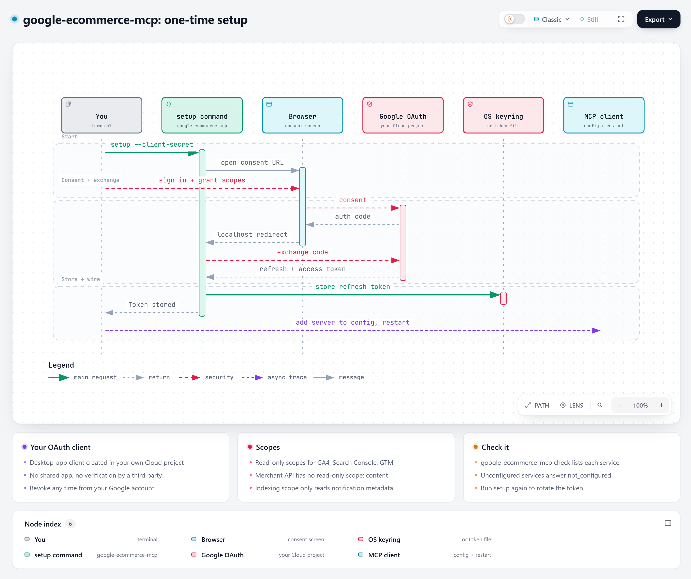

# Architecture

google-ecommerce-mcp is a small, local, read-only bridge between an MCP client (Claude Desktop, Claude Code, or any other MCP host) and six Google APIs.


Interactive version: [`diagrams/architecture-overview.html`](diagrams/architecture-overview.html) (open it locally in a browser; it is self-contained).

## Components

| Component | File | Role |
|---|---|---|
| Entry point | `src/google_ecommerce_mcp/__main__.py` | `setup`, `check`, or (default) run the MCP server over stdio |
| Configuration | `config.py` | Reads account ids from environment variables, defines the OAuth scopes |
| Credentials | `auth.py` | Stores the refresh token in the OS keyring (or a file), refreshes access tokens in memory |
| Installer | `installer.py` | `install` command: prompts, OAuth setup, Claude Desktop config merge with backup |
| Tools | `server.py` | 12 FastMCP tools, one HTTP session, every call wrapped so errors come back as data |

There is no database, no cache on disk, no background job and no network listener.

## Transport

The MCP client launches the server as a child process and talks to it over **stdio** (JSON-RPC on stdin/stdout). Nothing listens on a port, so nothing on your network can reach the server. The process lives as long as the client keeps it open.

## A tool call, step by step


1. You ask a question in the chat. The model picks a tool, for example `ga4_report`, and the client sends `tools/call`.
2. On the first call only, the server reads the refresh token from the OS keyring.
3. If the in-memory access token is missing or expired, `google-auth` refreshes it against Google's token endpoint. Access tokens live about one hour and are never written to disk.
4. The server calls the Google API with `Authorization: Bearer ...`.
5. The raw response is flattened into compact JSON (for example GA4 rows become `{"dimension": value, "metric": number}` objects). Report tools add what the model needs to read the numbers correctly: totals over every row, the unit and definition of each metric, and the date range resolved in the data's timezone with `data_complete`. The result goes back to the client.

## One-time setup



`google-ecommerce-mcp setup --client-secret client_secret.json` runs Google's installed-app OAuth flow: a temporary localhost redirect catches the authorization code, the code is exchanged for a refresh token, and the token is stored. The setup command is the only code path that writes the token.

## Design choices

**Read-only by construction.** Every request goes through `_send` in `server.py`, which checks it against `ALLOWED_ENDPOINTS` (method and URL pattern) and refuses anything else before it leaves the process. The list holds only `GET`s and the `POST`s Google uses for queries (`:runReport`, `:runRealtimeReport`, `searchAnalytics/query`, `index:inspect`, `reports:search`). `tests/test_server.py::test_every_request_is_on_the_read_only_allow_list` calls every tool and fails CI on any refused attempt; `test_allow_list_has_no_write_endpoint` guards the list itself.

**Errors are results, not exceptions.** A missing variable returns `{"error": "not_configured", ...}`, an HTTP error returns `{"error": <status>, "detail": ...}`, a network failure returns `{"error": "network", ...}`. The model can read and explain the problem instead of seeing a crashed tool.

**Configuration per service.** Every environment variable is optional. Configure only what you use; the other tools answer `not_configured`.

**Plain HTTP instead of Google client libraries.** The REST endpoints are called with `requests`. That keeps the install small (no `google-api-python-client` discovery documents) and makes each call visible in the source.

**Result caps.** Row-returning tools cap `limit` at 1,000 to keep answers within a model's context window. Merchant product scanning is paginated (250 per page, `max_pages` bound).

## Diagram sources

The diagrams are generated with Archify (MIT-licensed diagram renderer) from the JSON specifications next to them in [`docs/diagrams/`](diagrams/). Each one passed Archify's validate, deliver, check and browser-check gates at showcase quality. To change a diagram, edit the JSON and run:

```bash
archify finalize architecture docs/diagrams/architecture-overview.json docs/diagrams/architecture-overview.html --quality showcase
archify finalize sequence docs/diagrams/sequence-tool-call.json docs/diagrams/sequence-tool-call.html --quality showcase
archify finalize sequence docs/diagrams/sequence-setup.json docs/diagrams/sequence-setup.html --quality showcase
```
